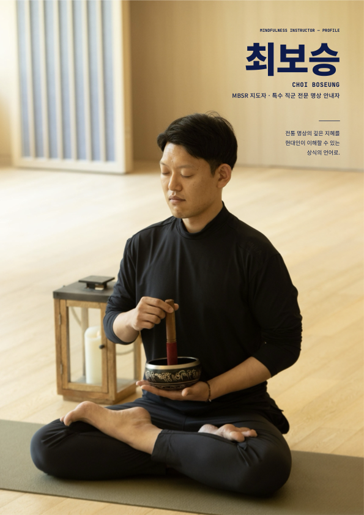

# 대구광역시교육청 학부모지원센터 학부모 대상
# MBSR 8회기 명상 프로그램
## 제안서 및 견적서

**Mind Breeze 2.0 · LINK BAND 2.0 뇌파 기반 명상 프로그램**

---

- 제출 기관 : ㈜룩시드랩스 (Looxid Labs)
- 제출 일자 : 2026년 9월
- 대상 기관 : 대구광역시교육청 학부모지원센터

```{=openxml}
<w:p><w:r><w:br w:type="page"/></w:r></w:p>
```

# 목차

1. 제안 개요
2. 추진 배경
3. MBSR 프로그램 소개
4. Mind Breeze 2.0 · LINK BAND 2.0
5. 프로그램 커리큘럼 (8회기)
6. 강사 소개
7. 운영 계획
8. 기대효과
9. [부록] 견적서

```{=openxml}
<w:p><w:r><w:br w:type="page"/></w:r></w:p>
```

# 1. 제안 개요

## 1-1. 제안 배경

대구광역시교육청 학부모지원센터는 학부모의 정서적 안정과 건강한 가정 환경 조성을 위한 지원 프로그램을 운영하고 있습니다. 본 제안은 학부모의 스트레스 완화와 자녀와의 관계 개선을 위해, 검증된 표준 명상 프로그램(MBSR)에 **뇌파·생체 신호 기반의 디지털 명상 서비스(Mind Breeze 2.0)**를 결합한 시범 프로그램을 제안하는 것입니다.

본 프로그램은 학부모가 명상 수련의 효과를 **눈으로 직접 확인**하며 몰입할 수 있도록, LINK BAND 2.0 뇌파 측정 장비를 통해 실시간 몸·마음 데이터(집중도·이완도·스트레스·호흡·심박 등)를 제공합니다.

## 1-2. 프로그램 개요

| 구분 | 내용 |
|---|---|
| 프로그램명 | MBSR 8회기 표준 과정 (뇌파 기반 디지털 명상 융합) |
| 교육 대상 | 대구광역시교육청 학부모 |
| 교육 과정 | MBSR 8회기 표준 커리큘럼 · 회기당 2시간 |
| 운영 방식 | 2개 클래스 순차 진행 · 클래스별 주 2회 · 총 8회기 (합계 16회차) |
| 운영 기간 | 2026년 10월 중순 개강 ~ 12월 종강 (총 8주, 클래스별 4주) |
| 진행 강사 | 최보승 (MBSR 지도자 · 특수 직군 전문 명상 안내자) |
| 활용 장비 | LINK BAND 2.0 40대 (뇌파·생체 신호 측정) |
| 교육 목표 | 주의 조절 훈련을 통한 스트레스 완화 및 수련 습관 형성 |

## 1-3. 제안의 특징

- **검증된 표준 프로그램** : 국제적으로 효과성이 입증된 MBSR(Mindfulness-Based Stress Reduction) 8회기 표준 커리큘럼을 그대로 적용합니다.
- **데이터로 확인하는 명상** : LINK BAND 2.0 착용으로 수련 중 집중도·이완도·스트레스·호흡·심박 등 몸과 마음의 변화를 실시간 확인하고, 회기별 리포트로 변화 추이를 확인합니다.
- **시범 사업(파일럿)으로의 최적화** : Mind Breeze 2.0의 공공기관 첫 도입을 전제로 한 합리적 제안가와 운영 노하우를 제공합니다.

```{=openxml}
<w:p><w:r><w:br w:type="page"/></w:r></w:p>
```

# 2. 추진 배경

## 2-1. 자녀 세대의 정신건강 지표 악화

- 중·고등학생 스트레스 인지율 **42.3%**, 우울감 경험률 **27.7%** — 2020년 34.2%·25.2%에서 지속 상승 (질병관리청, 2024 청소년건강행태조사)

## 2-2. 부모의 스트레스는 가정 안에서 자녀에게 이어짐

- 부모의 높은 스트레스와 양육스트레스는 온정 저하·가혹한 양육으로 이어지기 쉽고, 자녀·청소년의 정신병리·물질 사용·위험 행동과 연관됨 (Deater-Deckard, 1998; Chaplin et al., 2021a)
- 양육스트레스가 높은 가정일수록 부모와 자녀 모두의 심리적 안녕이 저하됨 (Burgdorf et al., 2019)
- 중·고등학생 자녀를 둔 어머니 307명 대상 국내 연구 — 마음챙김이 높을수록 양육스트레스가 낮고(r=−.50), 양육스트레스 감소를 거쳐 부모-자녀 관계가 좋아지는 경로 확인 (신웅·최은실, 2024)

> **시사점** — 자녀의 마음건강을 지키는 가장 가까운 자원은 부모의 안정된 마음입니다. 검증된 표준 프로그램으로 학부모의 스트레스 대응 역량을 기르는 것이 가정의 정서 환경을 지키는 교육청 차원의 접점이 됩니다.

```{=openxml}
<w:p><w:r><w:br w:type="page"/></w:r></w:p>
```

# 3. MBSR 프로그램 소개

## 3-1. 검증된 세속적 표준 프로그램

MBSR(Mindfulness-Based Stress Reduction, 마음챙김 기반 스트레스 완화)은 1979년 존 카밧진(Jon Kabat-Zinn)이 매사추세츠 의과대학에서 개발한 8회기 프로그램입니다. 바디스캔·정좌 명상·마음챙김 요가를 통해 "의도적으로, 지금 이 순간에, 판단 없이 주의 기울이기"를 훈련합니다.

- 종교 교리가 아닌 **세속적 형식의 근거 기반 프로그램**으로, 공교육 기관 운영에 적합합니다.
- 창시자 카밧진 부부가 MBSR의 원리를 자녀 양육에 적용한 '마음챙김 양육(Mindful Parenting)'을 제안 (Kabat-Zinn & Kabat-Zinn, 1997)

## 3-2. MBSR의 효과성

### 일반 성인

| 효과 영역 | 주요 실증 근거 |
|---|---|
| 스트레스 | Khoury et al.(2015) 대조군 대비 g=0.53, 스트레스에 큰 효과 · 19주 추적 유지 |
| 불안·우울 | Goyal et al.(2014) ES=0.38 · 0.30 / Hoge et al.(2023) 항불안제와 대등한 효과 |

### 학부모 대상

| 효과 영역 | 주요 실증 근거 |
|---|---|
| 양육스트레스 | Burgdorf et al.(2019) g=0.34 → 2개월 추적 g=0.53, 대조군 대비 g=0.44 |
| 부모 정신건강 | Dykens et al.(2014) MBSR RCT — 불안·우울·수면·안녕감 개선 |
| 부모-자녀 관계 | Chaplin et al.(2021a) 부모-청소년 관계의 질 향상 |
| 자녀 결과 | Burgdorf et al.(2019) g=0.27 / Chaplin et al.(2021b) 청소년 외현화 문제·물질 사용 증가 억제 |

```{=openxml}
<w:p><w:r><w:br w:type="page"/></w:r></w:p>
```

# 4. Mind Breeze 2.0 · LINK BAND 2.0

## 4-1. Mind Breeze 2.0

Mind Breeze 2.0은 **뇌파(EEG) 기반 심리상담·명상 통합 서비스** 플랫폼입니다. LINK BAND 2.0으로 실시간 뇌파를 측정하고, AI 기반 자동 기록·요약·리포트를 제공하여 명상 수련의 효과를 데이터로 확인할 수 있게 합니다.

## 4-2. LINK BAND 2.0

| 항목 | 사양 |
|---|---|
| 측정 전극 | Fp1 / Fp2 (전전두엽, 2채널) |
| 뇌파(EEG) | 250Hz 실시간 측정 |
| 생체 신호 | PPG(심박) 50Hz · ACC(움직임) 30Hz |
| 연결 방식 | Web Bluetooth (Chromium 기반 브라우저) |
| 분석 지표 | 집중도 · 이완도 · 스트레스 · 호흡 · 심박 · HRV 등 30여 종 지표 |

LINK BAND 2.0은 이마(전전두엽)에 착용하는 비침습형 웨어러블 뇌파 측정 장비로, 별도의 젤이나 전극 부착 없이 간편하게 착용할 수 있어 다수의 학부모가 함께 참여하는 그룹 명상에 적합합니다.

## 4-3. 몸·마음 데이터 리포트

명상 세션 동안의 데이터를 바탕으로 아래와 같은 변화를 확인할 수 있습니다.

- **몸** : 호흡수 ↓ · 심박수 ↓ · HRV(심박변이도) ↑ — 심신이 안정되는 방향으로 변화
- **마음** : 집중도 ↑ · 이완도 ↑ · 정서 안정 ↑ — 주의가 모이고 마음이 가라앉는 방향으로 변화

참여자는 매 회기 종료 후 개인별 리포트로 자신의 변화 추이를 확인하고, 수련을 지속할 동기를 얻습니다.

```{=openxml}
<w:p><w:r><w:br w:type="page"/></w:r></w:p>
```

# 5. 프로그램 커리큘럼 (8회기)

MBSR 국제 표준 커리큘럼 기준이며, 각 회기는 「수련 → 탐구 → 과제 안내」 흐름으로 진행합니다. 회기당 2시간(120분) 구성입니다.

| 회기 | 주제 | 핵심 수련 | 교육 내용 |
|---|---|---|---|
| 1회기 | 내적인 자원에 대한 재인식 | 건포도 명상, 바디스캔, 서서 하는 요가 | 마음챙김의 이해, 주의 조절 연습, 건포도 명상을 통해 마음챙김을 경험 |
| 2회기 | 지각과 창조적 대응 | 바디스캔, 주의 조절 연습, 9점 퍼즐 | 마음 방황의 보편성 이해, 틀에 갇힌 지각 습관 살펴보기 |
| 3회기 | 현존하는 기쁨과 힘 | 누워서 하는 요가, 정좌 명상 | 움직이는 몸과 멈춘 몸의 감각을 자각, 유쾌한 일이 생각·감정·몸에 나타나는 방식 탐구 |
| 4회기 | 스트레스 자동반응 | 서서 하는 요가, 정좌 명상 | 스트레스가 몸과 마음에 일으키는 반응(투쟁-도피)과 급성·만성 스트레스의 차이 이해 |
| 5회기 | 스트레스에 능숙하게 대응하기 | 정좌 명상, STOP 명상 | 자동적 '반응' 대신 알아차림으로 '대응'하기, STOP 명상, 스트레스 심화 이해 |
| 6회기 | 스트레스성 의사소통 | 서서 하는 요가, 정좌 명상 | 어려운 대화의 자동 반응 패턴 알아차리기, 소극적·공격적·주장적 의사소통 살펴보기 |
| 7회기 | 수련을 일상생활에 통합하기 | 움직임 수련, 걷기 명상, 정좌 명상 | 일상의 매 순간으로 마음챙김 이어가기, 안내 음원 없이 스스로 수련해 보기 |
| 8회기 | 배운 것을 지속하기와 지지 자원 검토 | 바디스캔, 정좌 명상 | 8주의 배움 돌아보기와 나누기, 수련을 이어가기 위한 지지 자원 정리 |

### 회기 진행 구성 (120분)

| 단계 | 시간 | 내용 |
|---|---|---|
| 도입 | 10분 | 환영과 안내, 지난 회기 과제 점검 |
| 본수련 ① | 40~50분 | 회기별 공식 수련, 상호 탐구(Inquiry) |
| 탐구 | 30분 | 보조 수련·교육, 주제별 교육 내용 전달 |
| 본수련 ② | 20분 | 과제 안내, 공식·비공식 수련 질의 |
| 마무리 | 10분 | 회기 마무리 |

```{=openxml}
<w:p><w:r><w:br w:type="page"/></w:r></w:p>
```

# 6. 강사 소개

{width=5.0in}

- **성명** : 최보승 (CHOI BOSEUNG)
- **자격·전문 분야** : MBSR 지도자 · 특수 직군 전문 명상 안내자
- **철학** : "전통 명상의 깊은 지혜를 현대인이 이해할 수 있는 상식의 언어로."

최보승 강사는 MBSR 국제 표준 커리큘럼에 충실한 8회기 과정을 운영하며, 학부모 등 다양한 직군의 참여자에게 명상의 원리를 일상의 언어로 전달하는 데 전문성을 갖추고 있습니다.

```{=openxml}
<w:p><w:r><w:br w:type="page"/></w:r></w:p>
```

# 7. 운영 계획

## 7-1. 운영 구성

| 항목 | 내용 |
|---|---|
| 클래스 구성 | 2개 클래스 순차 운영 |
| 클래스별 인원 | 클래스당 40명 (총 80명) |
| 운영 방식 | 클래스별 주 2회 · 4주 · 회기당 2시간 (8회기) |
| 총 회차 | 16회차 (2개 클래스 × 8회기) |
| 총 운영 기간 | 8주 (클래스당 4주씩 순차 진행) |

## 7-2. 장비 구성

| 장비 | 수량 | 용도 |
|---|---|---|
| LINK BAND 2.0 | 40대 | 참여자 뇌파·생체 신호 측정 (클래스당 40명) |
| Mind Breeze 2.0 플랫폼 | 1식 | 실시간 데이터 수집·분석·리포트 생성 |

장비의 운송·설치·철수 및 회기 중 장비 관리(충전, 페어링, 대여 반납 관리)는 룩시드랩스 운영팀이 지원합니다.

## 7-3. 일정 (안)

| 단계 | 시기 | 내용 |
|---|---|---|
| 사전 준비 | 10월 초·중순 | 일정 확정, 참여자 모집, 장비 준비·점검 |
| 프로그램 운영 | 10월 중순 ~ 12월 | 클래스별 주 2회, 총 8회기 · 2개 클래스 순차 진행 |
| 결과 보고 | 12월 | 회기별 리포트 및 운영 결과 공유 |

```{=openxml}
<w:p><w:r><w:br w:type="page"/></w:r></w:p>
```

# 8. 기대효과

| 대상 | 기대효과 |
|---|---|
| 학부모 개인 | 스트레스·불안·우울 감소와 정서조절 능력 향상, 몸의 긴장 알아차림과 심신 이완·수면의 질 개선, 8주 반복 수련으로 이어가는 수련 습관 형성 |
| 부모-자녀 관계 | 즉각 반응 대신 멈춘 뒤 대응하는 양육, 자녀에게 온전히 귀 기울이는 경청과 비판단적 수용, 양육스트레스 감소를 통한 관계의 질 향상 |
| 가정·학교 | 자녀 정서·행동 건강을 지지하는 가정의 정서 환경 강화, 학부모 대상 근거 기반 마음건강 지원 모델 마련 |

또한 본 시범 사업은 뇌파 기반 디지털 명상 서비스(Mind Breeze 2.0)의 공공기관 첫 도입 사례로서, 데이터 기반의 명상 프로그램 운영 모델을 정립하는 선도적 의미를 갖습니다.

```{=openxml}
<w:p><w:r><w:br w:type="page"/></w:r></w:p>
```

# 9. [부록] 견적서

## 9-1. 견적 요약

| 구분 | 회차당 단가 | 총 회차 | 합계 |
|---|---|---|---|
| LINK BAND 2.0 장비 대여료 | 200,000원 | 16회차 | 3,200,000원 |
| 강사비 | 200,000원 | 16회차 | 3,200,000원 |
| 출장비 | 100,000원 | 16회차 | 1,600,000원 |
| **공급가액 합계** | **500,000원** | 16회차 | **8,000,000원** |
| 부가가치세 (10%) | — | — | 800,000원 |
| **총액** | — | — | **8,800,000원** |

## 9-2. 견적 내역

### (1) LINK BAND 2.0 장비 대여료

| 품명 | 수량 | 대당 단가(회차) | 회차당 금액 | 총 금액(16회차) |
|---|---|---|---|---|
| LINK BAND 2.0 뇌파 측정 장비 | 40대 | 5,000원 | 200,000원 | 3,200,000원 |

### (2) 강사비

| 구분 | 산출 내역 | 회차당 금액 | 총 금액(16회차) |
|---|---|---|---|
| MBSR 전문강사 | 회기당 2시간 진행 (최보승 강사) | 200,000원 | 3,200,000원 |

### (3) 출장비

| 구분 | 산출 내역 | 회차당 금액 | 총 금액(16회차) |
|---|---|---|---|
| 출장비 | 서울↔대구 KTX 일반실 왕복(약 87,000원) + 시내 교통비 (강사 출발지 서울 기준) | 100,000원 | 1,600,000원 |

## 9-3. 견적 조건

| 항목 | 내용 |
|---|---|
| 견적 유효기간 | 견적일로부터 30일 |
| 결제 조건 | 협의 (선금/중도금/잔금 또는 회기별 정산) |
| 부가가치세 | 별도 (10%), 과세 여부는 세법 적용에 따름 |
| 비고 | 시범 사업(파일럿) 도입가 기준. 장비 대여료는 LINK BAND 2.0 40대 기준이며, 참여 인원·일정 확정 시 최종 조정 가능 |

---

### 공급자 정보

| 항목 | 내용 |
|---|---|
| 업체명 | ㈜룩시드랩스 (Looxid Labs) |
| 대표이사 | 채용욱 |
| 사업자등록번호 | 230-81-10210 |
| 주소 | 대전광역시 유성구 테크노9로 35, 3층 303호 |
| 연락처 | (협의) |
