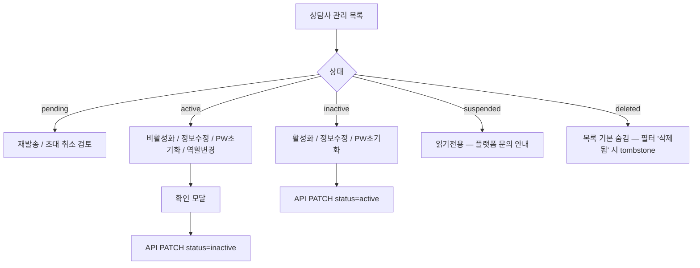
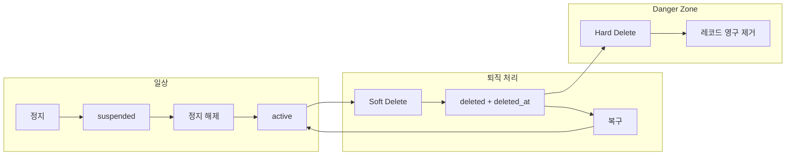

# SDD-018 UX/프론트 설계 리뷰 — 상담사 계정 생명주기

> **역할**: UX/프론트 설계 리뷰어 (Cursor)  
> **근거**: `00-research-brief.md`, `backend/app/models/user.py`, `frontend/src/components/layout/SidebarNav.tsx`, `frontend/src/pages/OrgDashboardPage.tsx`, `frontend/src/pages/admin/UserManagementPage.tsx`, `backend/app/api/v1/auth.py`  
> **Brian 최우선 결정**: 기관 관리자(`org_admin`)는 상담사 **삭제 불가**, **활성/비활성만** 제어

---

## 역할별 UX 목표

### 기관 관리자 (`org_admin`)

| 목표 | 설명 |
|------|------|
| **운영 가시성** | 소속 상담사·기관 관리자 계정의 초대·활성·비활성 상태를 한 화면에서 파악 |
| **안전한 제어** | 삭제·영구 제거 UI를 **노출하지 않음**. 실수로 계정이 사라지는 UX 방지 |
| **일상 업무 효율** | 초대·재발송·비밀번호 초기화·기본 정보 수정을 3클릭 이내로 수행 |
| **권한 경계 명확화** | "기관 비활성"과 "플랫폼 정지"를 다른 뱃지·문구로 구분해, org_admin이 해결 가능한 범위를 인지 |

**현재 갭 (코드 근거)**  
- `SidebarNav.tsx`의 `ORG_ADMIN_NAV_ITEMS`에 상담사 전용 메뉴 없음 (`91:98:frontend/src/components/layout/SidebarNav.tsx`)  
- 상담사 초대·목록이 `OrgDashboardPage.tsx`에만 존재하고, 활성/비활성·정보 수정·비밀번호 초기화 UI 없음  
- `org.ts`의 `removeCounselor`(DELETE)가 프론트 API에 노출되어 있으나, Brian 결정과 **의미 충돌** (소속 해제 vs 삭제 오해)

### 플랫폼 관리자 (`platform_admin`)

| 목표 | 설명 |
|------|------|
| **계층적 위험 관리** | 정지 → 소프트 삭제 → 하드 삭제 순으로 파괴성·UI 거리 증가 |
| **감사 가능성** | 정지 사유(`VerificationAudit` 패턴, `admin_service.suspend_user`)와 삭제 주체·시각 노출 |
| **복구 경로** | soft-deleted 계정 열람·복구(권장) 또는 tombstone 상태 확인 |
| **데이터 보존 인지** | hard delete 시 세션·리포트·EEG 등 연쇄 삭제(`admin_service.delete_user`)를 확인 UI에서 명시 |

**현재 갭**  
- `UserManagementPage.tsx`에서 **정지·삭제가 동일한 빨간 텍스트 링크**로 나란히 배치 (`200:221`)  
- `suspended` boolean만 표시, `pending`/`deleted`/`inactive` 구분 없음  
- 삭제 모달은 "영구 삭제" 문구이나 실제 API는 hard delete (`deleteUser`) — soft delete 개념 부재

### 상담사 (`counselor` / 초대 수락 전 `pending`)

| 목표 | 설명 |
|------|------|
| **상태별 명확한 안내** | 로그인 실패 시 원인(비활성·정지·삭제·초대 미완료)을 구분해 표시 |
| **복구 요청 경로** | org 비활성 → 기관 관리자 연락, 플랫폼 정지 → 고객지원, 삭제 → 별도 안내(자가 복구 불가) |
| **데이터 연속성 인지** | 비활성화돼도 과거 상담 기록은 보존됨을 안내(불안 완화) |
| **초대 온보딩 유지** | SDD-017 초대·SetPassword 플로우와 충돌 없이 `pending` 처리 |

**현재 갭 (중요 결함)**  
- `auth.py` 로그인 엔드포인트는 `user.status`를 **전혀 검사하지 않음** (`129:144:backend/app/api/v1/auth.py`) — suspended 계정도 로그인 가능할 수 있음  
- `LoginPage.tsx`는 401/423만 처리, 상태별 메시지 없음

---

## 기관 관리자 IA/플로우

### 1. 사이드바 IA (권장)

```
기관 대시보드     /dashboard/org          (요약·KPI·최근 클래스)
상담사 관리 ★     /org/counselors          (신규 — 전용 페이지)
세션              /sessions
내담자            /clients
리포트            /reports
알림              /notifications
설정              /settings
```

- **아이콘**: `ICONS.users` 재사용 (상담사·내담자 구분은 라벨로)
- **배지**: `pending` 초대 N명, `inactive` N명(선택) — 대시보드와 동기화
- **대시보드 역할 축소**: `OrgDashboardPage`의 `CounselorInviteSection`은 **요약 카드 + "상담사 관리로 이동"** CTA만 유지. 상세 테이블·액션은 전용 페이지로 이전

### 2. 기관 대시보드 (`/dashboard/org`) — 변경 후 구조

| 영역 | 내용 |
|------|------|
| KPI 카드 | 활성 상담사 수 / 대기(pending) / 비활성(inactive) / 정지(suspended, 읽기전용) |
| 기관 코드 | 기존 `OrgCodeCard` 유지 |
| 상담사 스냅샷 | 상위 5명 + "전체 보기 →" |
| 클래스·통계 | 기존 유지 |

**의도**: 대시보드는 **모니터링**, 상담사 관리 페이지는 **운영**.

### 3. 상담사 관리 페이지 (`/org/counselors`) — 화면 구조

#### 3.1 헤더·필터

- 검색: 이름·이메일
- 상태 필터: 전체 | 초대 대기 | 활성 | **비활성(기관)** | 정지(플랫폼, 읽기전용)
- 역할 필터: 상담사 | 기관 관리자
- Primary CTA: **+ 상담사 초대** (기존 초대 폼 모달/드로어)

#### 3.2 목록 테이블 컬럼

| 컬럼 | 비고 |
|------|------|
| 이름 | |
| 이메일 | |
| 역할 | `counselor` / `org_admin` 뱃지 |
| 계정 상태 | 통합 상태 뱃지 (아래 §상태 표현) |
| 초대일 | `invited_at` |
| 최근 활동 | 선택 — 세션 수 등 대시보드 API 연계 |
| 작업 | 행 액션 메뉴 |

#### 3.3 행 액션 (org_admin 허용 범위)

| 액션 | 대상 상태 | UI |
|------|-----------|-----|
| 초대 재발송 | pending, 만료 | 기존 `resendCounselorInvite` |
| **활성화** | inactive | Primary outline |
| **비활성화** | active | 확인 모달 — "로그인 불가, 예약된 세션은 별도 처리 필요" |
| 역할 변경 | active, inactive | counselor ↔ org_admin (마지막 org_admin 보호 — 서버 검증 전제) |
| 정보 수정 | active, inactive, pending | 사이드 패널: 이름·전화 (이메일은 읽기전용 또는 변경 시 재인증) |
| 비밀번호 초기화 메일 | active | "초기화 링크 발송" — org_admin이 **요청**만, 링크는 본인 메일로 |
| ~~소속 해제~~ / ~~삭제~~ | — | **UI에서 제거**. API `DELETE .../counselors/{id}` deprecate 후 410/403 |

**비활성화 확인 모달 copy (예시)**  
> "{이름}님을 비활성화하면 로그인과 신규 세션 생성이 중단됩니다. 과거 상담 기록과 리포트는 유지됩니다. 계속하시겠습니까?"

#### 3.4 org_admin 본인·동료 org_admin 처리

- `get_counselors()`가 `counselor`와 `org_admin`을 함께 반환 (`00-research-brief` §4)  
- **본인 비활성화** · **마지막 org_admin 비활성화/역할 변경** → 버튼 disabled + tooltip  
- primary_admin 보호는 서버(`remove_counselor` 보호 부재 — `00-research-brief` §5)와 UI disabled를 **쌍으로** 적용

#### 3.5 상태 뱃지 체계 (org 화면)

| 표시 | `status` + 컨텍스트 | 색상 |
|------|---------------------|------|
| 초대 대기 | pending, 만료 전 | amber |
| 초대 만료 | pending, `invite_expires_at` 경과 | red outline |
| 활성 | active | green |
| **비활성** | inactive (org_admin 설정) | gray |
| **정지** | suspended (플랫폼) | red + lock icon, org_admin 액션 불가 |

플랫폼 정지 계정에는 org_admin 액션 영역에:  
*"플랫폼 관리자에 의해 정지된 계정입니다. 기관에서 활성화할 수 없습니다."*

#### 3.6 액션 플로우 (mermaid)



---

## 플랫폼 관리자 IA/플로우

### 1. 사이드바·라우트 (현행 유지 + 보강)

```
기관 관리    /admin/orgs
사용자 관리  /admin/users     (라벨: "사용자 관리" — 역할 필터로 상담사 집중)
```

`/admin/users` 페이지를 **계정 생명주기 콘솔**로 재구성.

### 2. 목록 UI — 3-tier 액션 배치

| Tier | 액션 | 위치·스타일 |
|------|------|-------------|
| 1 (일상) | 정지 / 정지 해제 | 행 내 **중립·경고** 버튼. 정지=amber, 해제=green |
| 2 (퇴직·탈퇴) | **계정 비활성화 (Soft Delete)** | overflow `⋯` 메뉴 1번째. 회색, "복구 가능" 부연 |
| 3 (파괴) | **영구 삭제 (Hard Delete)** | overflow 최하단 **Danger Zone** 분리. 빨간 outline, 아이콘 ⚠ |

**현행 대비 변경 핵심**: `UserManagementPage.tsx`의 정지·삭제 **나란히 빨간 링크** 구조 폐기.

### 3. Soft Delete 플로우

1. overflow → "계정 비활성화 (소프트 삭제)"
2. 모달 1단: 영향 설명 — 로그인 차단, org 목록 기본 숨김, **세션·리포트·EEG 보존**
3. 모달 2단: 사유 입력(필수) + `DELETE`/`비활성화` 텍스트 입력 확인
4. 성공 → toast + 목록에서 기본 탭 제외

**복구 (권장 — UX 관점 필수)**  
- 상단 탭: `활성` | `정지됨` | **`삭제됨(복구 가능)`**  
- soft-deleted 행: `deleted_at`, `deleted_by`(관리자명), 사유 표시  
- Primary: **복구** → `status=active` (또는 inactive 전 org 상태로) + 감사로그  
- Secondary: **영구 삭제로 진행** → Tier 3 플로우

**논의 결론 (권고)**: soft-deleted **열람·복구는 MVP 포함**. tombstone만 두고 복구 UI 없으면 org_admin·상담사 CS 부담이 플랫폼으로 집중됨.

### 4. Hard Delete 플로우 (Danger Zone)

1. **선행 조건**: soft-deleted 상태에서만 hard delete 버튼 enabled (active/suspended에서 바로 hard delete **금지** — 2단계 안전장치)
2. 모달: 삭제 대상 데이터 요약 (세션 N건, 리포트 N건, EEG N건 — API prefetch)
3. 확인: 이메일 전체 입력 + "영구 삭제" 체크박스
4. 성공: 목록에서 완전 제거, 감사로그 `action=hard_delete`

**현행 hard delete의 문제**: `delete_user()`가 즉시 연쇄 DELETE — UI에서 Tier 3로 격상하지 않으면 운영 사고 위험 극대.

### 5. 정지 vs org 비활성 vs soft delete — 플랫폼 UI 구분

| 개념 | 주체 | 플랫폼 UI 라벨 | org_admin에게 |
|------|------|----------------|---------------|
| inactive | org_admin | "(기관) 비활성" — 플랫폼은 **열람만** | 해당 기관 관리자에게 위임 |
| suspended | platform_admin | "정지" | override 불가, 사유 표시 |
| deleted (soft) | platform_admin | "삭제됨" | 목록 미노출, 복구는 플랫폼만 |

플랫폼 관리자가 org_admin 계정에 대해서도 동일 Tier 적용. 단, **마지막 org_admin soft delete** 시 기관 orphaned 경고.

### 6. 플랫폼 액션 플로우



---

## 상담사 상태별 UX

### 상태 정의 (프론트 표시용)

| status | 로그인 | 진입 화면 | 복구 주체 |
|--------|--------|-----------|-----------|
| `pending` | 불가 (난수 해시) | 초대 메일 → Set Password | org_admin 재발송 |
| `active` | 가능 | 역할별 대시보드 | — |
| `inactive` | **불가** | 로그인 거부 전용 화면 | org_admin 활성화 |
| `suspended` | **불가** | 정지 안내 전용 화면 | platform_admin 해제 |
| `deleted` | **불가** | 삭제 안내 (최소 정보) | platform_admin 복구(soft) |

### 로그인 API·프론트 협약 (필수)

백엔드가 상태별 **구분 HTTP 코드 + machine-readable `code`** 반환:

| code | HTTP | LoginPage 메시지 |
|------|------|------------------|
| `ACCOUNT_PENDING` | 403 | "초대를 아직 완료하지 않았습니다. 받은 초대 메일의 링크로 비밀번호를 설정해주세요." |
| `ACCOUNT_INACTIVE` | 403 | "기관 관리자에 의해 비활성화된 계정입니다. 소속 기관 관리자에게 문의해주세요." |
| `ACCOUNT_SUSPENDED` | 403 | "플랫폼 이용이 정지된 계정입니다. 고객센터({supportEmail})로 문의해주세요." |
| `ACCOUNT_DELETED` | 403 | "더 이상 사용할 수 없는 계정입니다. 재가입 또는 복구가 필요하면 고객센터로 문의해주세요." |

**주의**: 현재는 모두 401로 뭉개질 수 있음 — **보안과 UX 모두 불리**. 상태별 403 + code 권장.

`LoginPage.tsx`에 `err.body?.code` 분기 추가. Google OAuth도 동일 code 매핑.

### 상태별 전용 안내 화면 (`/account-blocked`)

로그인 실패 시 query `?reason=inactive|suspended|deleted`로 **풀페이지 안내** (로그인 폼과 분리):

```
┌─────────────────────────────────────┐
│  🔒  계정을 사용할 수 없습니다        │
│  {상태별 제목}                        │
│  {설명 2~3문장}                       │
│  [로그인으로 돌아가기]  [고객센터 문의]  │
└─────────────────────────────────────┘
```

- **inactive**: "소속 기관: {orgName}" (개인정보 최소 노출 — org명만)
- **suspended**: "정지 사유는 보안상 표시되지 않을 수 있습니다" (사유는 platform_admin 감사로그에만)
- **deleted**: 자가 복구 버튼 **없음**. "복구 요청"은 mailto/support ticket 링크만

### 세션·토큰 UX

- inactive/suspended/deleted 전환 **즉시** refresh token 폐기 → 기존 로그인 사용자는 다음 API 호출 시 401 → `/account-blocked?reason=...`  
- WebSocket disconnect toast: "계정 상태가 변경되어 로그아웃되었습니다"

### pending (초대 미수락)

- 기존 `SetPasswordPage` / 초대 토큰 플로우 유지 (SDD-017)  
- 만료 시: org_admin 재발송 안내 페이지  
- **직접 로그인 시도**: `ACCOUNT_PENDING` + "초대 메일을 확인하세요"

### 비밀번호 초기화 (org_admin 요청)

- org_admin: "비밀번호 초기화 메일 발송" → 상담사 이메일로 링크  
- 상담사: 메일 → reset 페이지 (절대 URL — `00-research-brief` §8 이슈 반영)  
- inactive/suspended/deleted 상태에서는 reset 링크 **무효** + blocked 안내

### 이메일 재사용 (상담사 관점)

- soft-deleted tombstone: 동일 이메일 **신규 초대 불가** — org_admin 초대 폼 409 + "기존 계정 존재, 플랫폼 관리자에게 복구 요청"  
- 복구 후: 기존 이메일로 재로그인

---

## UX 리스크 및 개선 포인트

### 1. 로그인 시 status 미검증 (Critical)

`auth.py` login이 `user.status`를 확인하지 않아 suspended·inactive·deleted 계정 로그인 가능. **프론트 UX 설계 전제가 무너짐.** 백엔드 게이트 + 프론트 메시지 분기 필수.

### 2. org_admin "삭제" 오해 — DELETE API 라벨링

`removeCounselor`는 소속 해제(`org_id = None`)이나 API·클라이언트명이 "delete/remove". Brian 결정과 충돌. UI에서 제거하고, 레거시 API는 rename/deprecate. org_admin이 "삭제했다"고 생각하지만 계정이 남는 **이중 혼란** 방지.

### 3. 정지·삭제 동급 배치 (High)

`UserManagementPage.tsx` 정지·삭제 동일 스타일 → 운영자가 soft/hard 구분 없이 클릭. Tier 분리 + soft 선행 mandatory.

### 4. 상태 vocabulary 충돌 (High)

`OrgDashboardPage`의 InviteStatusBadge는 pending/active/expired만 (`49:55`). `inactive`·`suspended`·`deleted` 추가 시 **동일 "비활성" 라벨 남용 금지**. 기관 비활성 vs 플랫폼 정지 vs 삭제를 색·아이콘·tooltip 3종 분리.

### 5. org_admin이 suspended 계정 "활성화" 시도 (Medium)

UI disabled만으로는 API 직접 호출 가능. 프론트: 버튼 hidden + 403 toast. 서버: org_admin은 `inactive↔active`만.

### 6. 마지막 org_admin·본인 비활성화 (Medium)

`remove_counselor`에 self/last-admin 보호 없음 (`00-research-brief` §5). UI에서 disabled + 서버 409. 기관 **관리 공백** 시 orphaned org 대시보드 경고.

### 7. 대시보드 vs 전용 페이지 기능 중복 (Medium)

초대·목록이 `OrgDashboardPage`에만 있어 페이지 길어짐·액션 확장 시 유지보수 어려움. **IA 분리**하지 않으면 inactive 토글·PW reset 추가 시 대시보드 비대화.

### 8. hard delete 데이터 손실 인지 부족 (High)

현재 삭제 모달 한 줄 경고. 세션·리포트·EEG 연쇄 삭제(`admin_service.delete_user`)를 **숫자 요약** 없이 진행 → 복구 불가 사고. Tier 3 + 이메일 입력 확인.

### 9. soft-deleted 계정 invisible (Medium)

org_admin 목록에서 갑자기 사라지면 "삭제당했다" 오해. org 화면: 기본 숨김 + "플랫폼 처리된 계정" 필터(읽기전용 tombstone, 이름 마스킹 옵션). 플랫폼: 복구 탭.

### 10. 비밀번호 초기화 + 상태 전환 레이스 (Medium)

inactive 전환 직후 reset 링크 클릭, 또는 reset 완료 후에도 refresh token 잔존 (`00-research-brief` §8). reset 완료 시 전 token 폐기 + inactive면 reset 차단.

### 11. Google OAuth와 상태 게이트 (Medium)

이메일 로그인만 상태 분기하면 OAuth bypass. `loginGoogle` 동일 code 반환 필요.

### 12. CounselorAccountStatus 타입 한계 (Low)

`org.ts`가 `'pending' | 'active'`만 정의 (`36:36`). 확장 시 TS·뱃지·필터 일괄 업데이트 없으면 UI/타입 불일치.

---

## 최종 권고안

### A. 정보 구조 (우선순위 P0)

1. org_admin 사이드바에 **「상담사 관리」** (`/org/counselors`) 추가  
2. `OrgDashboardPage` 초대·목록 → 전용 페이지 이전, 대시보드는 KPI·스냅샷만  
3. org_admin UI에서 **삭제·소속 해제 액션 완전 제거** — 활성/비활성 토글만

### B. 상태·표현 (P0)

4. 통합 상태 enum: `pending | active | inactive | suspended | deleted`  
5. `deleted_at` / `deleted_by` UI 노출은 **플랫폼 관리자 전용**  
6. 뱃지 5종 + tooltip으로 org inactive vs platform suspended vs deleted 구분

### C. 플랫폼 관리자 (P0–P1)

7. 액션 3-Tier: 정지(일상) → soft delete(overflow) → hard delete(Danger Zone, soft 이후만)  
8. **「삭제됨(복구 가능)」** 탭 + 복구 버튼 — MVP 포함 권고  
9. hard delete: 데이터 건수 prefetch + 이메일 입력 확인

### D. 상담사 로그인·안내 (P0)

10. login/status gate + `ACCOUNT_*` code → `LoginPage` / `/account-blocked` 분기  
11. inactive → 기관 문의, suspended/deleted → 고객센터, pending → 초대 메일 안내  
12. 상태 변경 시 refresh token 전량 폐기 + WS disconnect

### E. API·레거시 정리 (P1, UX 연계)

13. `DELETE /org/.../counselors/{id}` → deprecate; org 비활성은 `PATCH status=inactive`  
14. `CounselorAccountStatus` 타입·필터·뱃지 컴ponent 공통화 (`CounselorLifecycleBadge`)  
15. org_admin 수정 필드: **이름·전화** 즉시, **이메일** 변경은 보류 또는 재인증 플로우 (쟁점 #4)

### F. 구현 순서 제안 (프론트)

```
Phase 1  Sidebar + /org/counselors 골격 + 상태 뱃지 + 목록(읽기)
Phase 2  활성/비활성 토글 + 확인 모달 + org_admin 보호 UX
Phase 3  LoginPage / account-blocked 상태별 안내 (백엔드 code 연동)
Phase 4  UserManagementPage Tier 재배치 + soft delete/복구 탭
Phase 5  Hard delete Danger Zone + PW reset org_admin CTA
```

### G. 브리프 판단에 대한 명시적 코멘트

- Brian 결정(**org_admin 삭제 불가, 활성/비활성만**)은 UX적으로 옳음. 현행 `removeCounselor`(소속 해제)는 **반드시 UI/API에서 분리·폐기**해야 함. "소속 해제"를 남기면 관리자 교육 비용만 증가.  
- soft delete를 `status='deleted'`만으로 표현할지 vs `deleted_at` 병행(쟁점 #1) — **UX 관점에서는 `deleted_at`/`deleted_by` 병행 권장**. 플랫폼 복구 탭·감사 표시에 필수.  
- hard delete는 플랫폼 전용 유지하되, **UI에서 soft 없이 hard 불가** 2단계를 UX로 강제.

---

*본 문서는 SDD-018 Stage ①~② 입력용 UX 리뷰이며, 코드 변경은 포함하지 않는다.*
