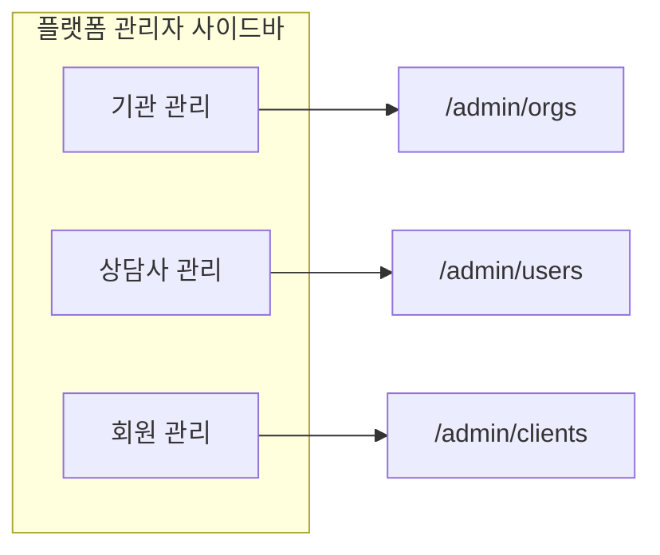

# SDD-020 UX/프론트 설계 리뷰 — 플랫폼 관리자 회원(내담자) 관리

> **역할**: UX/프론트 설계 리뷰어 (Cursor)  
> **근거**: `00-research-brief.md`, `frontend/src/components/layout/SidebarNav.tsx`, `frontend/src/pages/admin/UserManagementPage.tsx`, `frontend/src/pages/clients/ClientListPage.tsx`, `frontend/src/pages/admin/OrgManagementPage.tsx`, `backend/app/api/v1/admin.py`, `backend/app/models/client_counselor_link.py`  
> **제약**: 코드 수정 없음. Brian 요구 — "상담사 관리 페이지처럼" + 회원 수동 추가(상담사 배정)·비활성화·삭제

---

## 사이드바/페이지 IA

### 권장 구조: **별도 사이드바 항목 + 별도 라우트**

```
플랫폼 관리자 (platform_admin)
├── 기관 관리      /admin/orgs
├── 상담사 관리    /admin/users      ← 기존, role=counselor 고정
└── 회원 관리 ★    /admin/clients    ← 신규, role=client 고정
```

**코드 근거**  
- 현재 `ADMIN_NAV_ITEMS`는 2개만 존재 (`108:111:frontend/src/components/layout/SidebarNav.tsx`).  
- `UserManagementPage`는 제목이 "상담사 관리"이나 role 드롭다운에 `client`·`platform_admin` 등 **전체 역할**이 노출됨 (`117:126:frontend/src/pages/admin/UserManagementPage.tsx`) — 플랫폼 관리자 IA와 실제 UI가 불일치.

### 사이드바 상세

| 항목 | 라벨 | 경로 | 아이콘 | 비고 |
|------|------|------|--------|------|
| 기관 관리 | 기관 관리 | `/admin/orgs` | `ICONS.users` (유지) | 기존 |
| 상담사 관리 | 상담사 관리 | `/admin/users` | `ICONS.users` → **`user-check` 계열 분리 권장** | role 필터 **제거**, counselor만 |
| 회원 관리 | **회원 관리** | `/admin/clients` | **`user-circle` 또는 `heart-handshake` 계열** | 내담자(client) 전용 |

**라벨 용어**  
- 사이드바·페이지 타이틀: **「회원 관리」** (Brian 원문·플랫폼 관리자 콘솔 톤)  
- 본문·배지·빈 상태: **「내담자」** 병기 가능 (`AppShell sub="CLIENT MANAGEMENT"`)  
- `client` role 배지: 기존 `ROLE_LABELS.client = '내담자'` 유지 (`7:12:frontend/src/pages/admin/UserManagementPage.tsx`)

### `/admin/users` vs `/admin/clients` 탭 통합 — **비권장**

| 기준 | 탭/필터 통합 | 별도 페이지 (권장) |
|------|-------------|-------------------|
| Brian 요구 | "상담사 관리 **페이지처럼**" → 병렬 메뉴가 직관적 | ✅ |
| 컬럼 차이 | 회원은 **담당 상담사** 컬럼 필수 | ✅ |
| 추가 UX | 상담사=없음 / 회원=**수동 추가+배정 폼** | ✅ |
| 실수 방지 | role 드롭다운으로 client 삭제·counselor 정지 혼동 가능 | ✅ |
| SDD-018 | 상담사 lifecycle(5-state) vs 회원 suspend/delete 정책 분기 | ✅ |

### 페이지 헤더 (`AppShell`)

```
회원 관리                          [+ 회원 추가]
CLIENT MANAGEMENT
```

- Primary CTA: **`+ 회원 추가`** — `ClientListPage`의 `내담자 초대` 버튼 패턴 (`82:90:frontend/src/pages/clients/ClientListPage.tsx`)과 동일 위치(`rightSlot`).

### IA 다이어그램



---

## 회원 목록/추가/액션 플로우

### 1. 회원 목록 (`/admin/clients`)

#### 레이아웃 (데스크톱 테이블)

| 컬럼 | 내용 | 비고 |
|------|------|------|
| 이름 | `user.name` | |
| 이메일 | `user.email` | break-all (모바일 카드 동일) |
| 담당 상담사 | 연결된 counselor `name` (+ 이메일 tooltip) | **API 확장 필요** — 현재 `UserDto`에 link 정보 없음 (`59:66:frontend/src/lib/api/admin.ts`) |
| 상태 | 활성 / 정지됨 | `StatusBadge` 재사용 (`33:43:frontend/src/pages/admin/UserManagementPage.tsx`) |
| 가입일 | `created_at` | `formatDate` 재사용 |
| 관리 | 정지·해제·삭제 | 상담사 페이지와 동일 톤 |

#### 필터 바

```
[ 이름 또는 이메일 검색...                    ]  [담당 상담사 ▼]  총 N명
```

- **역할 드롭다운 없음** — 이 페이지는 `role=client` 고정.  
- (Phase 2) 담당 상담사 필터 — counselor_id 쿼리 파라미터. MVP는 검색만.

#### API 호출

- `listUsers({ role: 'client', q, page, size: 20 })` — 기존 엔드포인트 재사용 (`123:128:frontend/src/lib/api/admin.ts`).

#### 빈 상태

```
등록된 회원이 없습니다.
[+ 회원 추가] 로 첫 회원을 등록하세요.
```

#### 모바일

- `UserManagementPage` 카드 뷰 패턴 유지 (`138:176`) + **담당 상담사** 한 줄 추가.

---

### 2. 회원 수동 추가 플로우

#### 진입

1. 목록 헤더 **`+ 회원 추가`** 클릭  
2. **모달(Sheet)** — `OrgManagementPage` 생성 폼·`UserManagementPage` 확인 모달 중간 크기 (`max-w-lg`)

#### 폼 필드 (Step 없음 — 단일 화면)

| 필드 | 필수 | 검증 | UX |
|------|------|------|-----|
| 이름 | ✅ | 1~50자 | placeholder: "홍길동" |
| 이메일 | ✅ | RFC 형식, 중복 시 서버 409 | placeholder: "client@example.com" |
| 담당 상담사 | ✅ | active counselor 1명 | → [상담사 배정 UI](#상담사-배정-ui) |
| (선택) 초대 메일 발송 | ☑ 기본 ON | — | `OrgManagementPage` invite_sent 패턴 |

**계정 생성 방식 (UX 권고: 초대 메일)**  

| 방식 | UX | 보안 | 권고 |
|------|-----|------|------|
| (a) 임시 비밀번호 | 관리자가 복사·전달 부담 | 유출 위험 | △ |
| **(b) 초대 메일** | 기관 담당자 초대와 동일 mental model | SetPassword 링크 | **✅ MVP** |
| (c) 관리자 비밀번호 지정 | 가장 위험, 감사 추적 어려움 | 최악 | ✗ |

- 성공 시: `OrgManagementPage`처럼 **결과 배너** — "○○@email 로 초대 메일을 발송했습니다" + 담당 상담사 이름.  
- 초대 미발송 선택 시: "계정이 생성되었습니다. 비밀번호 설정 링크를 별도로 발송하세요." (운영 리스크 — 기본값은 발송 ON).

#### 제출 후

```
[취소]  [회원 추가]
         ↓ 성공
목록 refresh + toast "회원이 추가되었고 ○○ 상담사와 연결되었습니다"
모달 close
```

#### 에러 처리

| 코드 | UI |
|------|-----|
| 409 이메일 중복 | 필드 하단 "이미 등록된 이메일입니다" + 기존 회원 목록 링크(선택) |
| 404/422 상담사 | "선택한 상담사를 찾을 수 없습니다. 다시 선택해 주세요." |
| 422 미인증 상담사 | "인증되지 않은 상담사는 배정할 수 없습니다." (`ClientOnboardingPage` 6자리 코드 검증 메시지와 정합) |

#### 플로우 다이어그램

```mermaid
sequenceDiagram
  participant A as 플랫폼 관리자
  participant UI as 회원 추가 모달
  participant API as POST /admin/clients
  participant Link as ClientCounselorLink

  A->>UI: + 회원 추가
  A->>UI: 이름·이메일·상담사 입력
  UI->>API: create + counselor_id
  API->>Link: active link 생성
  API-->>UI: 201 + invite_sent
  UI-->>A: toast + 목록 갱신
```

---

### 3. 비활성화·삭제 액션 플로우

Brian 용어 **「비활성화」** vs 현재 API **`suspend`(정지)** — SDD-018 미구현 상태에서의 UX 정렬:

| Brian 표현 | MVP UI 라벨 | API | 비고 |
|-----------|------------|-----|------|
| 비활성화 | **정지** (또는 "계정 정지") | `POST /admin/users/{id}/suspend` | org_admin의 `inactive`와 혼동 방지 tooltip |
| (재)활성화 | **정지 해제** | `POST /admin/users/{id}/unsuspend` | |
| 삭제 | **삭제** | `DELETE /admin/users/{id}` | 현재 **hard delete** |

#### 정지 (suspend)

1. 행 액션 **「정지」** 클릭  
2. 확인 모달 — `UserManagementPage` 패턴 (`253:299`)  
   - 제목: "회원 정지"  
   - 본문: `"홍길동 (email@...) 님을 정지하시겠습니까? 정지 시 로그인 및 서비스 이용이 차단됩니다."`  
   - **정지 사유 textarea (필수)** — 기존과 동일  
3. 확인 → 목록 refresh + toast

#### 정지 해제 (unsuspend)

- 모달: 사유 입력 **불필요** (기존 상담사 플로우 동일)

#### 삭제 (delete)

1. 행 액션 **「삭제」** 클릭  
2. **2단계 확인** 권장 (hard delete 위험):

**1차 모달**  
- "회원 삭제"  
- "이 회원과 연결된 세션 기록·리포트·뇌파 데이터 등이 **영구 삭제**될 수 있습니다. 되돌릴 수 없습니다."

**2차 확인 (Destructive)**  
- 이메일 재입력: `삭제하려면 이메일을 입력하세요: [________]`  
- 또는 checkbox: "데이터 영구 삭제를 이해했습니다"

3. `deleteUser(id)` → refresh

> **SDD-018 교차**: 상담사 쪽 soft delete 도입 시 회원도 동일 3-Tier(정지→soft delete→hard delete)로 **문구·모달만 공유**하고 API 의미는 spec에서 재정의 필요. MVP는 기존 hard delete UI에 **경고 강화**만.

#### 액션 가시성 규칙

| 상태 | 정지 | 정지 해제 | 삭제 |
|------|------|----------|------|
| 활성 (`suspended=false`) | ✅ | — | ✅ |
| 정지 (`suspended=true`) | — | ✅ | ✅ |

- `platform_admin` 계정은 이 페이지에 노출되지 않음 (role=client 필터).

---

## 상담사 배정 UI

### 컴포넌트: **검색 가능 Combobox** (MVP)

shadcn `Command` + `Popover` 패턴 또는 네이티브 `<input>` + 결과 리스트 — 프로젝트에 Combobox 없으므로 **경량 자체 구현** 권장.

#### 레이아웃 (회원 추가 모달 내)

```
담당 상담사 *
┌─────────────────────────────────────────────┐
│ 🔍 상담사 이름 또는 이메일 검색...           │
└─────────────────────────────────────────────┘
  ┌─ 검색 결과 (최대 8건) ─────────────────┐
  │ ● 김상담  kim@clinic.com               │
  │   ○○ 상담센터 · 활성 · 인증완료         │
  │ ○ 이상담  lee@...                      │
  │   △△ 기관 · 활성 · 인증대기  (비활성)   │
  └────────────────────────────────────────┘

선택됨: [ 김상담 × ]  kim@clinic.com · ○○ 상담센터
```

#### 데이터 소스

- `listUsers({ role: 'counselor', q: debouncedQuery, size: 20 })` — 기존 API 재사용.  
- **필터 (클라이언트)**: `suspended === false`만 선택 가능.  
- **필터 (서버 권고)**: `verified_tier` 또는 credential approved counselor만 — `ClientOnboardingPage`의 "인증 미완료 상담사 매칭 불가"와 동일 (`305:307`).

#### 검색 UX

| 동작 | spec |
|------|------|
| Debounce | 300ms |
| 최소 입력 | 1자 (한글 이름) 또는 빈 값 시 **최근/active 상담사 5명** |
| 키보드 | ↑↓ 선택, Enter 확정, Esc 닫기 |
| 빈 결과 | "검색 결과가 없습니다" |
| 로딩 | 입력창 우측 spinner |

#### 결과 행 정보

| 표시 | 출처 |
|------|------|
| 이름 (Primary) | `user.name` |
| 이메일 (Secondary) | `user.email` |
| 소속 기관 | `org_name` — **API 확장 필요** (현재 UserDto에 없음) |
| 상태 칩 | 활성 / 정지됨 — 정지된 항목은 **disabled + 회색** |
| 인증 | 인증완료 / 인증대기 — 미완료는 선택 불가 + tooltip |

#### 선택 후

- **Chip** 형태로 상단 고정: `이름 ×`  
- 변경 시 chip 제거 → 재검색  
- **1명만** — `ClientCounselorLink` unique constraint (`15:15:backend/app/models/client_counselor_link.py`). MVP 다중 배정 UI 금지.

#### (Phase 2) 목록 내 상담사 재배정

- 행 클릭 → **회원 상세 Drawer** → "담당 상담사 변경" — SDD-020 MVP 범위 밖이면 spec에 Out of Scope 명시.

#### 모바일

- Combobox → **전체 화면 Bottom Sheet** 검색 (터치 타겟 44px+).

---

## 컴포넌트 공유 판단

### 결론: **별도 페이지 + 선택적 공유 컴포넌트**

| 접근 | 판단 | 이유 |
|------|------|------|
| `UserManagementPage`에 props만 추가 | ✗ | role 필터·컬럼·CTA·추가 폼이 분기 난립. 제목 "상담사 관리"와 client 목록 공존은 IA 모순 |
| 탭으로 `/admin/users?tab=clients` | △ | URL 공유는 좋으나 Brian "나란히" 사이드바 요구와 불일치 |
| **`ClientManagementPage` 신규 + 공통 추출** | **✅** | 역할별 IA 명확, SDD-018 상담사 lifecycle 변경과 독립 |

### 공유 추출 권장 (`frontend/src/components/admin/`)

| 컴포넌트 | 출처 | 공유 |
|----------|------|------|
| `AdminStatusBadge` | `StatusBadge` | ✅ |
| `AdminUserTableShell` | 테이블·카드·페이지네이션 | ✅ (columns slot) |
| `AdminConfirmModal` | suspend/delete 모달 | ✅ (variant: suspend \| unsuspend \| delete) |
| `AdminUserSearchBar` | 검색 input + total | ✅ |
| `CounselorPicker` | 신규 | ✅ (회원 추가 + 향후 재배정) |
| `RoleBadge` | 회원 페이지 | ✗ (client 고정이면 불필요) |
| `ClientAddModal` | 신규 | ✗ (회원 전용) |
| 페이지 전체 | — | ✗ 분리 |

### `UserManagementPage` 리팩터 (동시 권고)

- role 기본값 `counselor` 유지 + **role 드롭다운 제거** (상담사 전용화).  
- `/admin/clients` 추가와 **한 PR 세트**로 IA 정합성 확보.

### 상담사 `ClientListPage`와의 관계

| | 상담사 `/clients` | 플랫폼 `/admin/clients` |
|--|-------------------|-------------------------|
| 대상 | 본인 연결 내담자 | **전체** client |
| 추가 | 초대 링크 (`InviteModal`) | **수동 생성 + 배정** |
| 액션 | 프로필 열람 | 정지·삭제 |
| 컴포넌트 공유 | InviteModal ✗ / 카드 스타일 참고만 | |

---

## UX 리스크 및 개선 포인트

### 1. 용어 혼선: 「회원」vs「내담자」vs `client`

- 사이드바「회원 관리」·역할 배지「내담자」·상담사 메뉴「내담자」(`/clients`)가 공존.  
- **개선**: 플랫폼 콘솔은 "회원", 상담사 뷰는 "내담자"로 역할별 고정. 페이지 subtitle에 `내담자(client) 계정` 한 줄 정의.

### 2. 사이드바 아이콘 3종 동일 (`ICONS.users`)

- 기관·상담사·회원이 같은 아이콘 → 스캔 어려움 (`108:111:SidebarNav.tsx`).  
- **개선**: 회원 관리 전용 아이콘 분리 (예: single-user + heart).

### 3. 담당 상담사 미표시 API 갭

- `listUsers` 응답에 counselor link 없음 → 목록 핵심 컬럼 공백.  
- **개선**: `AdminClientListItem` DTO에 `primary_counselor: { id, name, email } | null` 확장. 없으면 **「미배정」** 주황 배지.

### 4. 상담사 배정 없이 회원 생성 가능성

- `ClientCounselorLink` 없는 client는 온보딩 Step 4(코드 매칭)로 유도 — 관리자 수동 추가 목적 상실.  
- **개선**: 프론트·백 모두 counselor_id **필수**. 제출 버튼 disabled until selected.

### 5. 미인증·정지 상담사 배정

- `ClientOnboardingPage`는 미인증 상담사 코드 거부. 관리자가 우회 배정하면 내담자 온보딩 dead-end.  
- **개선**: CounselorPicker에서 인증완료+활성만 selectable. 서버 422 mirror.

### 6. 「비활성화」vs「정지」 라벨 불일치

- Brian "비활성화" ≠ SDD-018 org `inactive` ≠ 현재 `suspend`.  
- **개선**: UI는 **「정지」** + tooltip "플랫폼 관리자에 의한 계정 정지(로그인 차단)". SDD-018 착수 시 회원용 `inactive` 필요 여부 별도 spec.

### 7. Hard delete UI vs 사용자 기대

- 모달 "영구 삭제" (`267:267:UserManagementPage.tsx`) — 실제 FK 연쇄 삭제. 회원은 EEG·상담 기록 민감.  
- **개선**: 이메일 재입력 2차 확인 + 삭제 대상 데이터 요약 bullet. SDD-018 soft delete 전환 시 문구 일괄 변경 계획 명시.

### 8. 이메일 중복 — 자가 가입 vs 관리자 추가

- 동일 이메일이 RegisterPage 자가 가입(`RegisterPage.tsx`)으로 존재 시 409.  
- **개선**: 409 메시지에 "기존 회원 상세 보기" 링크(목록 필터 q=email). 중복 시 상담사만 link 추가 API 분기는 MVP 이후.

### 9. `/admin/users` role 드롭다운 잔존 시 cross-role 사고

- 현재 client 목록에서 counselor **삭제** 클릭 가능 — role 혼재 위험.  
- **개선**: SDD-020과 함께 상담사 페이지 role 필터 **제거**. 회원 액션은 `/admin/clients`만.

### 10. 수동 추가 vs 초대 플로우 이중화

- 상담사 `InviteModal` / 플랫폼 수동 추가 / RegisterPage 초대 — 3경로.  
- **개선**: 플랫폼 회원 추가 success 화면에 "상담사 초대 링크 대비 차이" 1줄 FAQ. 운영 매뉴얼 링크(선택).

### 11. 정지 직후 로그인 가능 (백엔드 갭)

- SDD-018·`auth.py` — status/suspended 미검증 시 정지 UX 무의미 (`00-research-brief` #4 연계).  
- **개선**: 프론트 설계는 정지=즉시 차단 **전제**. verify.md에 로그인 차단 E2E 필수.

### 12. 모바일 CounselorPicker 사용성

- 긴 상담사 목록 + 기관명 2줄 → 작은 모달 overflow.  
- **개선**: 모바일 full-screen sheet, sticky 검색바.

---

## 최종 권고안

### IA·라우팅

1. **`ADMIN_NAV_ITEMS`에 `{ to: '/admin/clients', label: '회원 관리' }` 추가** — 기관·상담사와 **동급 3번째 메뉴**.  
2. **`/admin/users`는 상담사 전용** — role 드롭다운 제거, `listUsers({ role: 'counselor' })` 고정.  
3. **탭 통합하지 않음** — 컬럼·CTA·추가 폼 차이가 IA 분리 정당화.

### 회원 관리 페이지

4. **`ClientManagementPage`** 신규 — `UserManagementPage` 레이아웃 복제하되:  
   - role=client 고정  
   - **담당 상담사** 컬럼  
   - **`+ 회원 추가`** CTA  
5. 목록·정지·삭제는 기존 admin API 재사용; **create + link**만 신규 API.

### 수동 추가

6. **초대 메일 방식(b)** MVP — `OrgManagementPage` invite 패턴.  
7. 폼: **이름 + 이메일 + CounselorPicker(필수)** + 초대 발송 checkbox(기본 ON).

### 상담사 배정 UI

8. **Debounced 검색 Combobox** — `listUsers(role=counselor, q)` + 활성·인증완료만 선택.  
9. 선택 chip + 기관명·상태 secondary line.

### 컴포넌트

10. **페이지 분리, 프리미티브 공유** — `AdminConfirmModal`, `AdminUserTableShell`, `CounselorPicker` 추출.  
11. `UserManagementPage`·`ClientManagementPage` 각 150~200 LOC 이하 유지 목표.

### SDD-018·운영 정책

12. MVP UI 라벨 **「정지」/「정지 해제」** — Brian "비활성화"는 tooltip으로 매핑.  
13. 삭제는 **hard delete + 2차 확인** until soft delete landed.  
14. `verify.md`에 **8개 이상** 시나리오: 미배정 방지, 미인증 상담사 거부, 정지 후 로그인 차단, 삭제 cascade 안내, 409 중복, counselor picker 키보드, 모바일 sheet, `/admin/users` role 제거 회귀.

### 구현 순서 (UX 관점)

```
Phase 1  Sidebar + ClientManagementPage 목록 (read-only, counselor 컬럼 mock→API)
Phase 2  CounselorPicker + 회원 추가 모달
Phase 3  정지·삭제 모달 (공통 컴포넌트 추출)
Phase 4  UserManagementPage role 드롭다운 제거 (IA 정합)
```

---

*본 문서는 SDD-020 Stage ①~② 입력용 UX 리뷰이며, 코드 변경은 포함하지 않는다.*
